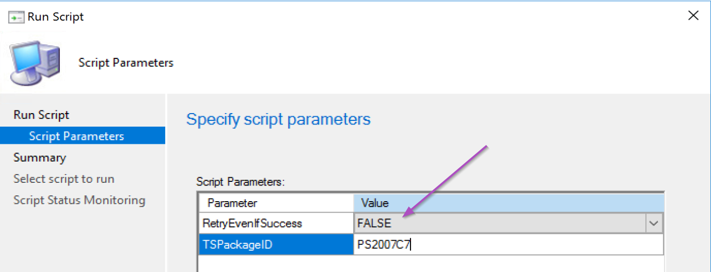
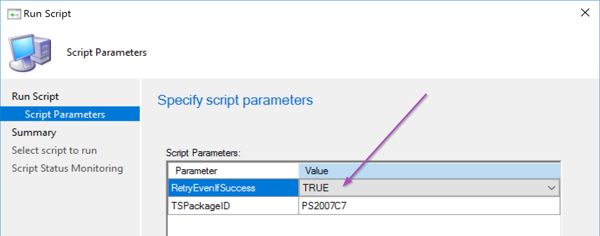

# Start-TaskSequence

This script is meant to be used as a RunScript in ConfigMgr, however you can steal the code for whatever you want.

There is a switch in the script that checks the execution history for the task sequence, if already successfully ran, will exit out of the script.  You can override this by switching to "TRUE".

## Demos

### Demo - Already Successfully Ran Previously - Exit Script

[](StartTS01.png)
[](StartTS02.png)

### Demo - Already Successfully Ran Previously - Force Re-run

[](StartTS03.png)
[](StartTS05.png)

## CODE

This is the heart of the code that triggers the task sequence, which makes up a small part of the larger script, but I've had requests for just the basics. Thanks to Client Center for surfacing code when running commands, making it easy to grab useful code.

```PowerShell
$TSPackageID = 'PS2007C7'  #This is your TS Package ID for the TS you want to Trigger

#Don't Chanage below this
$TSLastGroup = '6F6BCC28'
$TSScheduleMessageID = (get-wmiobject -query "SELECT * FROM CCM_Scheduler_ScheduledMessage WHERE ScheduledMessageID LIKE""%-$TSPackageID-$TSLastGroup""" -namespace "ROOT\ccm\policy\machine\actualconfig").ScheduledMessageID
if ($TSScheduleMessageID){$TSDeployID = $TSScheduleMessageID.Split("-")[0]}       
get-wmiobject -query "SELECT * FROM CCM_Scheduler_ScheduledMessage WHERE ScheduledMessageID='$TSDeployID-$TSPackageID-$TSLastGroup'" -namespace "ROOT\ccm\policy\machine\actualconfig" | Out-Null
$a=([wmi]"ROOT\ccm\policy\machine\actualconfig:CCM_TaskSequence.ADV_AdvertisementID='$TSDeployID',PKG_PackageID='$TSPackageID',PRG_ProgramID='*'");$a.ADV_RepeatRunBehavior='RerunAlways';$a.Put() | Out-Null
$a=([wmi]"ROOT\ccm\policy\machine\actualconfig:CCM_TaskSequence.ADV_AdvertisementID='$TSDeployID',PKG_PackageID='$TSPackageID',PRG_ProgramID='*'");$a.ADV_MandatoryAssignments=$True;$a.Put() | Out-Null
$a=([wmi]"ROOT\ccm\policy\machine\actualconfig:CCM_TaskSequence.ADV_AdvertisementID='$TSDeployID',PKG_PackageID='$TSPackageID',PRG_ProgramID='*'");$a.PRG_Requirements='<?xml version=''1.0'' ?><SWDReserved>    <PackageHashVersion>1</PackageHashVersion>    <PackageHash.1></PackageHash.1>    <PackageHash.2></PackageHash.2>    <NewPackageHash></NewPackageHash>    <ProductCode></ProductCode>    <DisableMomAlerts>false</DisableMomAlerts>    <RaiseMomAlertOnFailure>false</RaiseMomAlertOnFailure>    <BalloonRemindersRequired>false</BalloonRemindersRequired>    <PersistOnWriteFilterDevices>true</PersistOnWriteFilterDevices>    <DefaultProgram>true</DefaultProgram>    <PersistInCache>0</PersistInCache>    <DistributeOnDemand>false</DistributeOnDemand>    <Multicast>false</Multicast>    <MulticastOnly>false</MulticastOnly>    <MulticastEncrypt>false</MulticastEncrypt>    <DonotFallback>false</DonotFallback>    <PeerCaching>true</PeerCaching>    <OptionalPreDownload>true</OptionalPreDownload>    <PreDownloadRule></PreDownloadRule>    <Requirements></Requirements>    <AssignmentID></AssignmentID>    <ScheduledMessageID>CAS29CDE-CAS04823-6F6BCC28</ScheduledMessageID>    <OverrideServiceWindows>TRUE</OverrideServiceWindows>    <RebootOutsideOfServiceWindows>FALSE</RebootOutsideOfServiceWindows>    <WoLEnabled>FALSE</WoLEnabled>    <ShowTSProgressUI>FALSE</ShowTSProgressUI>    <UseTSCustomProgressMessage>FALSE</UseTSCustomProgressMessage>    <TSCustomProgressMessage><![CDATA[]]></TSCustomProgressMessage>    <ContainsAdditionalProperties>FALSE</ContainsAdditionalProperties></SWDReserved>';$a.Put() | Out-Null
foreach ($TS in $TSScheduleMessageID)
    {
    ([wmiclass]'ROOT\ccm:SMS_Client').TriggerSchedule($($TS)) | Out-Null
    write-output "Triggered $TSPackageID"
    }
```
